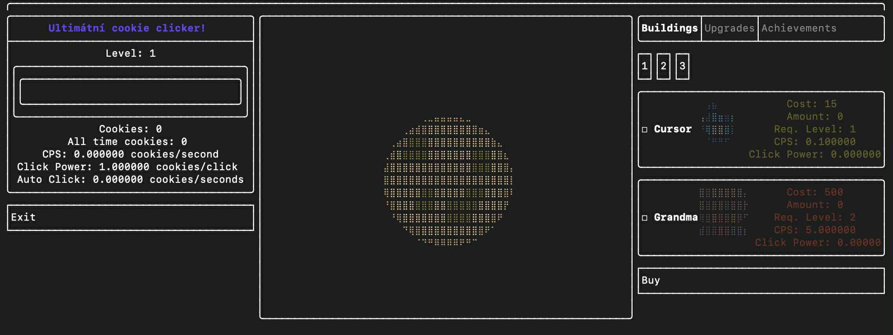

# 🍪 Cookie Clicker Clone

Moderní implementace populární hry Cookie Clicker v C++ s interaktivním textovým uživatelským rozhraním.

## 📋 Přehled

Toto je klonování hry Cookie Clicker napsané v C++. Hra běží v terminálu s grafickým rozhraním postaveným na knihovně FTXUI, která umožňuje tvorbu pokročilých textových uživatelských rozhraní.



## ✨ Funkcionalita

- *🖱️ Klikání na cookies* - Získávej cookies klikáním myší na hlavní cookie
- *🏢 Nákup budov* - Automatizuj produkci cookies nákupem různých budov (Babička, Farma, Továrna...)
- *⬆️ Upgrades* - Vylepšuj budovy a zvyšuj jejich efektivitu a výnos
- *🖼️ PNG grafika** - Podpora PNG obrázků pro vizuální prvky hry
- *📊 Statistiky** - Sleduj svůj pokrok a výnosy

## 🛠️ Požadavky

### Systémové požadavky
- **Unix-based systém** (Linux, macOS) nebo **Docker kontejner**
- C++17 nebo vyšší
- CMake 3.16+
- Ninja build system
- FTXUI knihovna
- STB Image (včleněna v projektu)

> ⚠️ **Důležité**: Projekt je optimalizován pro unixové systémy. Na Windows se doporučuje použít Docker kontejner nebo WSL2.

## 🚀 Kompilace

Projekt lze zkompilovat **pouze** pomocí následujících příkazů:

```bash
mkdir -p build 
cd build
cmake -DCMAKE_BUILD_TYPE=Release -DCMAKE_MAKE_PROGRAM=/usr/bin/ninja -G Ninja -S .. -B .
cmake --build . --config Release --target all -- -j4


